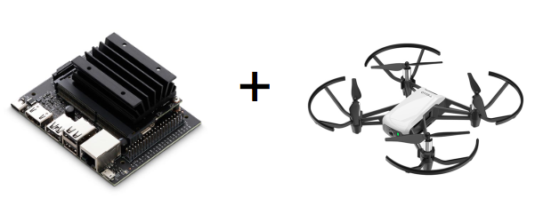

# jetson-tello



Utility code for using the NVIDIA [Jetson](https://developer.nvidia.com/embedded/jetson-nano-developer-kit) and [tello-asyncio](https://tello-asyncio.readthedocs.io/en/latest/) to interact with the [Tello EDU](https://www.ryzerobotics.com/tello-edu) drone.

The primary function so far is to pipe video frame data from the drone through to neural networks running on the Jetson, typically for object or face detection.

Created for my autonomous drone hobby project, [drone-braain](https://github.com/robagar/drone-braain), which is very much in its infancy. 

Package [jetson-tello](https://pypi.org/project/jetson-tello/) on PyPi. 

Full documentation on [Read the Docs](https://tello-asyncio.readthedocs.io/en/latest/).

## Prerequisites

There are two prerequisites that require manual installation:

* NVIDIA's [jetson-inference](https://github.com/dusty-nv/jetson-inference) project, following these [instructions](https://github.com/dusty-nv/jetson-inference/blob/master/docs/building-repo-2.md) to build from source and install.

* My fork of [h264decoder](https://github.com/robagar/h264decoder). This is identical to the [original repo](https://github.com/DaWelter/h264decoder) apart from building with the slightly old version of CMake (3.10) available on the Jetson.

## Example code

The [flying_drone_face_and_object_detection.py](./examples/flying_drone_face_and_object_detection.py) example demonstrates feeding video frames to object and face detection neural nets


``` python
#!/usr/bin/env python3

import asyncio
import jetson.inference
from jetson_tello import run_jetson_tello_app


face_detector = jetson.inference.detectNet("facenet", threshold=0.5)
object_detector = jetson.inference.detectNet("ssd-mobilenet-v2", threshold=0.5)


def detect_faces_and_objects(drone, frame, cuda):
    face_detections = face_detector.Detect(cuda)
    object_detections = object_detector.Detect(cuda)

    print('faces:')
    for d in face_detections:
        print(d)

    print('objects:')
    for d in object_detections:
        print(d)


async def fly(drone):
    await drone.takeoff()
    for i in range(4):
        await drone.turn_clockwise(90)
        await asyncio.sleep(3)
    await drone.land()


run_jetson_tello_app(fly, process_frame=detect_faces_and_objects)
```

Which typically outputs a stream of results like this (along with a fair amount of spam from the h.264 decoder):

```
    faces:
    <detectNet.Detection object>
       -- ClassID: 0
       -- Confidence: 0.809878
       -- Left:    434.667
       -- Top:     0
       -- Right:   702.267
       -- Bottom:  302.5
       -- Width:   267.6
       -- Height:  302.5
       -- Area:    80949
       -- Center:  (568.467, 151.25)
    objects:
    <detectNet.Detection object>
       -- ClassID: 7
       -- Confidence: 0.500977
       -- Left:    0
       -- Top:     7.30054
       -- Right:   959
       -- Bottom:  719.04
       -- Width:   959
       -- Height:  711.74
       -- Area:    682559
       -- Center:  (479.5, 363.171)
```

## Version history

**1.0.0**

- Decode h.264 video frame data from the drone and load into NumPy arrays and CUDA memory
- Face and object detection neural net examples
- [Common Objects in Context](https://cocodataset.org/) (COCO) classes

**1.1.0**

- Fly drone and process CUDA frames app utility function
- Decoded frame data object